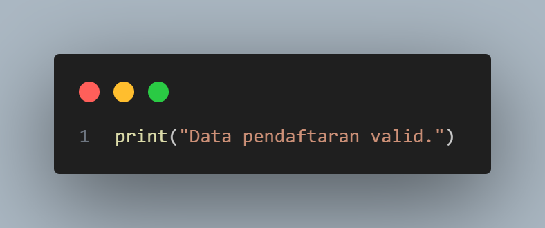

# LATIHAN STRING

## Step 1 : Fungsi validasi_form

Fungsi ini digunakan untuk memvalidasi data pendaftaran pengguna, seperti nama lengkap, nomor telepon, dan email. Fungsi akan meminta input dari pengguna dan mengecek apakah data yang dimasukkan memenuhi kriteria validasi tertentu.

## Step 2 : Input Data dari Pengguna 

* nama_lengkap: Meminta pengguna untuk memasukkan nama lengkapnya. Input disimpan sebagai string.
* nomor_telepon: Meminta pengguna untuk memasukkan nomor teleponnya. Input disimpan sebagai string.
* email: Meminta pengguna untuk memasukkan alamat emailnya. Input disimpan sebagai string.

## Step 3 : Validasi Nama Lengkap

* nama_lengkap.replace(" ", ""): Menghapus semua spasi dalam nama lengkap. Ini berguna agar nama seperti "John Doe" tetap valid.
* .isalpha(): Mengecek apakah semua karakter yang tersisa setelah spasi dihapus adalah huruf alfabet.
* Logika: Jika nama lengkap tidak memenuhi syarat hanya berisi huruf, maka fungsi mencetak pesan error dan langsung keluar dengan perintah return.

## Step 4 : Validasi Nomor Telepon

* .isdigit(): Mengecek apakah semua karakter dalam input adalah digit (angka 0-9).
* Logika: Jika nomor telepon tidak hanya berisi angka, maka fungsi mencetak pesan error dan langsung keluar.

## Step 5 : Validasi Email

* "@" not in email: Mengecek apakah karakter @ ada dalam string email.
* "." not in email: Mengecek apakah karakter . ada dalam string email.
* Logika: Jika email tidak mengandung karakter @ atau ., fungsi mencetak pesan error dan langsung keluar.

## Step 6 : Pesan Validasi Berhasil

Jika semua validasi berhasil dilewati, fungsi mencetak pesan bahwa data pendaftaran valid.

## Step 7 : Memanggil Fungsi

Memulai Program: Baris ini menjalankan fungsi validasi_form() sehingga pengguna dapat mulai memasukkan data untuk divalidasi.

## CONTOH JALANNYA PROGRAM

## OUTPUT : 

# KESIMPULAN : 

Kesimpulan dari program ini adalah bahwa program ini dirancang untuk memvalidasi data yang dimasukkan oleh pengguna ke dalam sebuah formulir. Program memastikan bahwa nama lengkap hanya berisi huruf, nomor telepon hanya berisi angka, dan email memiliki format dasar yang benar dengan keberadaan karakter "@" dan ".". Jika salah satu dari ketentuan ini tidak terpenuhi, program akan memberikan pesan error dan menghentikan proses. Sebaliknya, jika semua input valid, program akan menampilkan pesan bahwa data pendaftaran valid. Validasi ini bertujuan untuk mencegah kesalahan data input yang dapat berdampak pada penggunaan selanjutnya.
